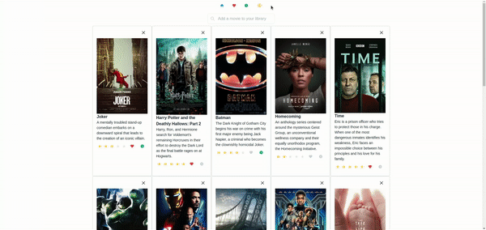

<div id="top"></div>

<h3 align="center">Custom Movie Library</h3>

  <p align="center">
    <br />
    <a href="#demos">View Demo's</a>
  </p>
</div>


<!-- TABLE OF CONTENTS -->
<details>
  <summary>Table of Contents</summary>
  <ol>
    <li>
      <a href="#about-the-project">About The Project</a>
      <ul>
        <li><a href="#built-with">Built With</a></li>
      </ul>
    </li>
    <li>
      <a href="#getting-started">Getting Started</a>
      <ul>
        <li><a href="#prerequisites">Prerequisites</a></li>
        <li><a href="#installation">Installation</a></li>
      </ul>
    </li>
    <li><a href="#license">License</a></li>
    <li><a href="#contact">Contact</a></li>
  </ol>
</details>


<!-- ABOUT THE PROJECT -->
## About The Project

Your own custom movie library. Keep your favourite movies or movies that you are interested in all in one place.

### Built With

* [React.js](https://reactjs.org/)
* [Redux](https://redux.js.org/)
* [Chakra UI](https://chakra-ui.com/)


## Demo's




<!-- GETTING STARTED -->
## Getting Started

To get a local copy up and running follow these steps

### Prerequisites

* npm
  ```sh
  npm install npm@latest -g
  ```
### Installation

1. Get a free API Key at [https://www.omdbapi.com](https://www.omdbapi.com/)
2. Clone the repo
   ```sh
   git clone https://github.com/ikolokotronis/custom-movie-library.git
   ```
3. Install NPM packages
   ```sh
   npm install
   ```
4. Enter your API key in `api/config.js`
   ```js
   const API_KEY = 'KEY_HERE';
   ```
5. Compile and run   
   ```js
   npm start
   ```

<!-- LICENSE -->
## License

Distributed under the MIT License. See `LICENSE.txt` for more information.


<!-- CONTACT -->

## Contact
Ioannis Kolokotronis - ioanniskolokotronis1@gmail.com

Project Link: [https://github.com/ikolokotronis/custom-movie-library](https://github.com/ikolokotronis/custom-movie-library)

<p align="right">(<a href="#top">back to top</a>)</p>
